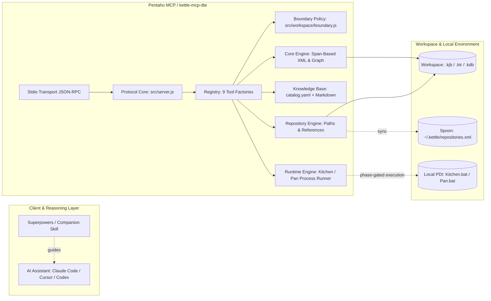
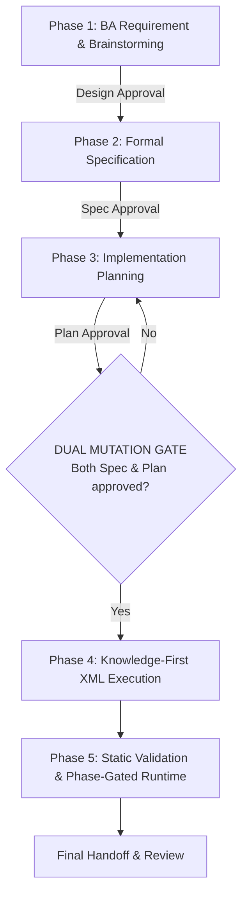

# Pentaho MCP

[](https://nodejs.org/)
[](https://modelcontextprotocol.io/)
[](docs/tools-reference.md)
[](docs/install.md)
[](LICENSE)

> **Production-grade Model Context Protocol (MCP) for Pentaho Kettle (`.kjb` / `.ktr`) artifacts**: Lossless span-based XML inspection and editing, embedded Pentaho knowledge catalog, static structural validation, file repository management, and optional phase-gated local PDI runtime execution.
>
> 🌐 **Language / Ngôn ngữ**: **English** | [Tiếng Việt](README.vi.md)

---

## 📑 Table of Contents

- [Overview](#-overview)
- [Key Features](#-key-features)
- [41 Production Tools Surface](#-41-production-tools-surface)
- [System Architecture](#-system-architecture)
- [Recommended 5-Phase Workflow](#-recommended-5-phase-workflow)
- [Quickstart](#-quickstart)
  - [1. Source Mode (For Developers)](#1-source-mode-for-developers)
  - [2. Self-Contained Windows Executable (.exe)](#2-self-contained-windows-executable-exe-for-end-users)
- [Client Configuration](#-client-configuration)
  - [Claude Code](#claude-code)
  - [Cursor](#cursor)
  - [Windsurf](#windsurf)
  - [Kiro](#kiro)
  - [Codex CLI](#codex-cli)
- [Configuration & Environment Variables](#-configuration--environment-variables)
- [Companion Skill](#-companion-skill)
- [Non-Goals & Safety Invariants](#-non-goals--safety-invariants)
- [Documentation Hub](#-documentation-hub)
- [Contributing & License](#-contributing--license)

---

## 💡 Overview

**Pentaho MCP** (advertised as `kettle-mcp-dte` on stdio) is a specialized **Model Context Protocol (MCP)** tool suite that enables AI coding assistants (such as Claude Code, Cursor, Windsurf, Kiro, and Codex) to safely inspect, create, edit, validate, and execute Pentaho Data Integration (PDI / Kettle) **Jobs (`.kjb`)** and **Transformations (`.ktr`)**.

The system follows a strict architectural separation: **Deterministic Primitives + External Reasoning**:
- **Pentaho MCP**: Provides deterministic, lossless primitives: byte-exact XML span editing, hop coordinate calculations, schema-compliant step insertion, static graph validation, and repository reference migration.
- **The AI Client / Superpowers Workflow**: Performs the high-level reasoning: requirement analysis, design brainstorming, formal specification, and execution planning.

---

## ✨ Key Features

- 🎯 **Lossless Span-Based XML Editing**: Uses `fast-xml-parser` to pinpoint element byte offsets and only modifies the targeted byte spans. Preserves 100% of the original tag ordering, formatting, XML comments, whitespace, and CRLF/LF line endings expected by Pentaho Spoon.
- 🧠 **Embedded Knowledge-First Catalog**: Bundles a rich knowledge catalog (`catalog.yaml` and Markdown specifications in `src/knowledge/pentaho/`). AI agents never hallucinate Pentaho XML tags; they inspect canonical templates via `kettle_knowledge_get` before creating or updating steps/entries.
- ⚡ **Zero-PDI Core Dependency**: All read, create, edit, hop wiring, parameter modification, repository tracking, and static validation operations run on pure Node.js — **no Java, PDI, or Spoon installation required** for core features.
- 🛡️ **Canonical Workspace Boundary Containment**: Enforces strict directory boundaries via `src/workspace/boundary.js`. Rejects path traversals (`..`), sibling-prefix escapes, and symlink/junction escapes outside the resolved workspace root.
- 🗄️ **Full Repository & Database Connection Support**: Native handling for Pentaho File Repositories, internal path resolution (`${Internal.Entry.Current.Directory}`), `.kdb` shared database connection files, and automatic Spoon `repositories.xml` detection.
- 🚦 **Phase-Gated Runtime Execution**: Optional local PDI execution (`Kitchen.bat` / `Pan.bat`) protected by dual safeguards: environment opt-in (`PENTAHO_ENABLE_EXECUTE=1`), invocation-level confirmation (`confirmed: true`), and mandatory pre-run static validation.

---

## 🛠️ 41 Production Tools Surface

The production surface exposes **exactly 41 tools** (strictly enforced via set-equality check in `verify:profile`), categorized into 8 functional groups:

| Group | Count | Representative Tools | Primary Purpose |
|-------|:-----:|----------------------|-----------------|
| **Read** | 4 | `kettle_list`<br>`kettle_summary`<br>`kettle_get_element`<br>`kettle_search` | List workspace artifacts, summarize elements & hop graphs, inspect step details (including full SQL), and perform bounded full-workspace searches. |
| **Edit** | 9 | `kettle_create_file`<br>`kettle_add_element`<br>`kettle_set_field`<br>`kettle_set_field_path`<br>`kettle_set_fields`<br>`kettle_edit_hops`<br>`kettle_add_error_hop`<br>`kettle_rename_element`<br>`kettle_clone` | Create empty `.kjb`/`.ktr` files, insert steps/entries from knowledge templates, update single or nested fields, populate repeatable tables, wire hops, and clone elements. |
| **Artifact** | 2 | `kettle_set_parameters`<br>`kettle_copy_connection` | Manage artifact-level parameters and safely copy `<connection>` blocks between artifacts without writing plaintext passwords (variables or encrypted values only). |
| **Removal** | 2 | `kettle_remove_element`<br>`kettle_edit_error_hop` | Safely remove steps/entries (blocks if references exist unless `removeReferences: true` is set for atomic cascade), and enable/disable/delete error handling routes. |
| **Connections** | 6 | `kettle_connection_list`<br>`kettle_connection_get`<br>`kettle_connection_put`<br>`kettle_connection_delete`<br>`kettle_connection_usage`<br>`kettle_connection_rename` | Manage lifecycle and track usages of shared database connections (`.kdb`) within a Pentaho File Repository. |
| **Repository** | 9 | `kettle_repository_list`<br>`kettle_repository_mkdir`<br>`kettle_set_reference`<br>`kettle_repository_references`<br>`kettle_repository_move`<br>`kettle_repository_migrate_references`<br>`kettle_repository_recover`<br>`kettle_repository_detect`<br>`kettle_repository_register` | Pentaho File Repository operations: move/rename files with automatic cross-reference updates, detect Spoon registries, and register workspaces into `repositories.xml`. |
| **Validate** | 1 | `kettle_validate` | Static structural validation of single artifacts or entire workspace trees (detects orphaned hops, cycles, missing START entries, unresolved parameters). |
| **Knowledge** | 4 | `kettle_knowledge_list`<br>`kettle_knowledge_get`<br>`kettle_knowledge_analyze_xml`<br>`kettle_knowledge_coverage` | Query the embedded component catalog, fetch canonical step/job templates, analyze external sample XML, and evaluate catalog coverage. |
| **Runtime** | 4 | `kettle_runtime_detect`<br>`kettle_runtime_loadcheck`<br>`kettle_runtime_execute`<br>`kettle_runtime_logs` | Probe local PDI installation, run non-executing loadchecks, execute pipelines via Kitchen/Pan, and retrieve redacted tail-buffered runtime logs. |

👉 For full parameters, input schemas, and call examples, see the [41 Tools Reference Guide (`docs/tools-reference.md`)](docs/tools-reference.md).

---

## 🏛️ System Architecture



---

## 🔄 Recommended 5-Phase Workflow

To ensure reliable, error-free ETL artifacts, development is structured into a 5-phase lifecycle guarded by a **Dual Mutation Gate**:



1. **Phase 1 — Requirements & Design**: Clarify sources, targets, parameters, and failure strategies. Only read-only tools (`kettle_list`, `kettle_summary`, `kettle_knowledge_*`) may be invoked.
2. **Phase 2 — Specification**: Draft a formal specification covering boundaries, artifact inventory, variables, job/transformation definitions, and acceptance criteria.
3. **Phase 3 — Planning**: Produce an artifact-by-artifact execution plan: leaf `.ktr` transformations first -> dependent `.ktr` -> orchestrating `.kjb` jobs last.
4. **Phase 4 — Execution**: The mutation gate opens only after both Spec and Plan are approved. Before configuring any step or entry, inspect its canonical schema with `kettle_knowledge_get`.
5. **Phase 5 — Verification & Handoff**: Run `kettle_validate` across individual files and the entire workspace tree. Only when **zero structural errors** remain can optional runtime verification (`loadcheck`, `execute`) be performed.

👉 Read the complete playbook in the [5-Phase Workflow Guide (`docs/workflow-guide.md`)](docs/workflow-guide.md).

---

## 🚀 Quickstart

### 1. Source Mode (For Developers)

**Prerequisites**: Node.js >= 20.

```powershell
# 1. Clone repository and install dependencies
git clone https://github.com/TumRoyal/pentaho-mcp-server.git
cd pentaho-mcp-server
npm install

# 2. Run full test suite and verify production tool profile
npm test
npm run verify:profile

# 3. Run on stdio
node src/index.js
```

### 2. Self-Contained Windows Executable (.exe, For End Users)

No local Node.js or `npm install` needed. Pentaho MCP, all runtime dependencies, and the full knowledge base are bundled into a single binary.

```powershell
# 1. Build release package
npm run build:release -- --version 1.0.0

# 2. Verify health and dependencies with the doctor script
.\build\release\doctor.ps1 -PentahoHome C:\Pentaho\data-integration
```

Extract the release ZIP from `dist/` into a stable path (e.g. `C:\Tools\dte-pentaho-mcp\`) to configure with your AI clients.

---

## 🔌 Client Configuration

> **Workspace root:** no environment variable sets the workspace root. The server auto-detects it on startup, mirroring Spoon: a file repository declared in `~/.kettle/repositories.xml` (the default repository wins, otherwise the first repository whose `base_directory` exists), else a `repositories.xml` inside `PENTAHO_HOME`, else the server process's working directory. Because there is no env override, the only ways to pin a project are to register it in `~/.kettle/repositories.xml`, or to start the client with the project as its working directory. All paths passed to tools are still validated against the resolved root by the workspace boundary.

### Claude Code

Add to your project's `.mcp.json`:

```json
{
  "mcpServers": {
    "dte-pentaho": {
      "command": "node",
      "args": ["C:/path/to/pentaho-mcp-server/src/index.js"],
      "env": {
        "PENTAHO_HOME": "C:/Pentaho/data-integration",
        "PENTAHO_ENABLE_EXECUTE": "0"
      }
    }
  }
}
```

*(For the standalone `.exe`, set `command` to `C:/Tools/dte-pentaho-mcp/dte-pentaho-mcp.exe` and `args` to `[]`)*

### Cursor

Add to `.cursor/mcp.json` (or via Settings -> MCP Servers):

```json
{
  "mcpServers": {
    "dte-pentaho": {
      "command": "C:/Tools/dte-pentaho-mcp/dte-pentaho-mcp.exe",
      "args": [],
      "env": {
        "PENTAHO_HOME": "C:/Pentaho/data-integration"
      }
    }
  }
}
```

### Windsurf

Add to `~/.codeium/windsurf/mcp_config.json`:

```json
{
  "mcpServers": {
    "dte-pentaho": {
      "command": "node",
      "args": ["C:/path/to/pentaho-mcp-server/src/index.js"],
      "env": {
        "PENTAHO_HOME": "C:/Pentaho/data-integration"
      }
    }
  }
}
```

### Kiro

Configure in `.kiro/settings/mcp.json` (workspace) or `%USERPROFILE%/.kiro/settings/mcp.json` (global):

```json
{
  "mcpServers": {
    "dte-pentaho": {
      "command": "C:/Tools/dte-pentaho-mcp/dte-pentaho-mcp.exe",
      "args": [],
      "env": {
        "PENTAHO_HOME": "C:/Pentaho/data-integration"
      }
    }
  }
}
```

### Codex CLI

Add to `.codex/config.toml`:

```toml
[mcp_servers.dte-pentaho]
command = "C:/Tools/dte-pentaho-mcp/dte-pentaho-mcp.exe"
args = []

[mcp_servers.dte-pentaho.env]
PENTAHO_HOME = "C:/Pentaho/data-integration"
```

---

## ⚙️ Configuration & Environment Variables

| Variable | Description | Default | Required |
|----------|-------------|---------|:--------:|
| `PENTAHO_HOME` | Path to local Pentaho Data Integration directory containing `Kitchen.bat` / `Pan.bat`. Also checked for a `repositories.xml` during workspace root detection. | Unset | Only for Runtime |
| `PENTAHO_REPOSITORY_NAME` | Optional repository name override. Falls back to the repository name detected from `repositories.xml`. | Detected from `repositories.xml` | Optional |
| `PENTAHO_ENABLE_EXECUTE` | Opt-in gate for executing pipelines. Only `"1"` enables execution; all other values disable it. | `"0"` (disabled) | Optional |
| `KETTLE_KNOWLEDGE_DIR` | Custom override path for the embedded knowledge base directory. | `src/knowledge/pentaho` | Optional |

The workspace root is **auto-detected per start-up and cannot be set by an environment variable** — see [Client Configuration](#-client-configuration). All tool paths stay confined to that root by the workspace boundary; relative paths resolve against it, and absolute paths are valid only when contained within it.

👉 For containment rules and security details, see the [Configuration Guide (`docs/configuration.md`)](docs/configuration.md).

---

## 🧩 Companion Skill

This repository includes a specialized companion skill located at **`skills/developing-pentaho-jobs/`**:
- `SKILL.md`: 5-phase lifecycle orchestration, mutation gating, knowledge lookups, and static acceptance criteria.
- `references/pentaho-spec-template.md`: Formal Pentaho specification template.
- `references/pentaho-plan-template.md`: Artifact-by-artifact implementation plan template.

*Note: Skills are not automatically activated by being present in the repository; copy the skill directory into your client's designated skills path (see [Installation Guide](docs/install.md)).*

---

## 🚫 Non-Goals & Safety Invariants

To keep Pentaho MCP deterministic, robust, and safe:
- ❌ **No Automated Deployments or Git Mutations**: Pentaho MCP never commits, pushes, or alters Git branches.
- ❌ **No Runtime Knowledge Mutation**: The embedded knowledge catalog is immutable and read-only.
- ❌ **No Business Data Validation**: `kettle_validate` verifies structural XML correctness for Spoon/Kitchen execution; it does not audit ETL data business logic.
- ❌ **No MCP Prompts or Resources**: Pentaho MCP advertises `capabilities = { tools: {} }` only, with no prompts or resources.

---

## 📖 Documentation Hub

Detailed documentation is available in the [`docs/`](docs/README.md) directory:

- 🗺️ **[Documentation Hub (docs/README.md)](docs/README.md)**: Role-based reading paths and navigation map.
- 🏗️ **[System Architecture](docs/architecture.md)**: Deep dive into the span-based XML engine, module map, and containment policy.
- ⚙️ **[Configuration & Boundaries](docs/configuration.md)**: Workspace confinement, environment variables, and process limits.
- 🛠️ **[41 Tools Reference Guide](docs/tools-reference.md)**: Complete parameter and schema documentation for all 41 tools.
- 📋 **[5-Phase Workflow Playbook](docs/workflow-guide.md)**: Step-by-step guide for turning BA requirements into validated Kettle artifacts.
- 💻 **[Development & Contribution](docs/development.md)**: Repository setup, testing conventions, and Windows release packaging.
- 🚀 **[Installation Manual](docs/install.md)**: Detailed setup instructions for source and packaged modes.
- 🩺 **[Operations & Troubleshooting](docs/operations.md)**: Health checks via `doctor.ps1`, log retention, and diagnostic procedures.
- 🔍 **[Documentation Facts](docs/documentation-facts.md)**: Single Source of Truth reference table.
- 📊 **[PDI 9.4 Compatibility Evidence](docs/pdi94-evidence-report.md)** & **[File Repository Evidence](docs/pdi94-repository-evidence.md)**: Verified test evidence on Pentaho 9.4.

---

## 🤝 Contributing & License

- **Contributions**: Please read [CONTRIBUTING.md](CONTRIBUTING.md) for development workflows, testing guidelines, and PR checklists.
- **License**: Distributed under the [MIT License](LICENSE).
