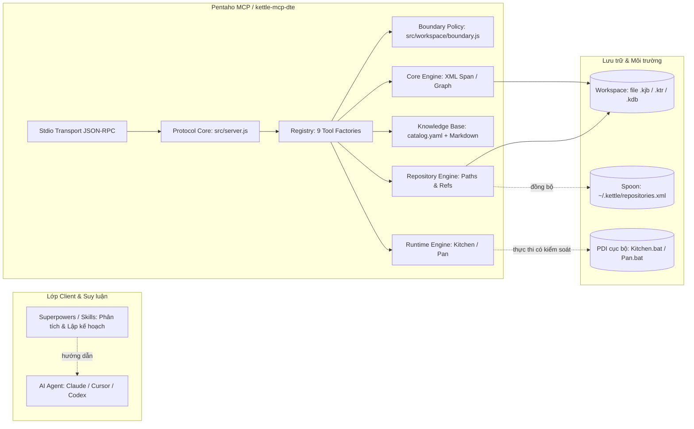
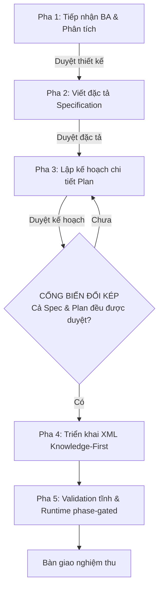

# Pentaho MCP

[](https://nodejs.org/)
[](https://modelcontextprotocol.io/)
[](docs/tools-reference.md)
[](docs/install.md)
[](LICENSE)

> **Bộ công cụ Model Context Protocol (MCP) chuẩn cho Pentaho Kettle (`.kjb` / `.ktr`)**: Kiểm tra và chỉnh sửa XML span-based ít mất mát, tri thức Pentaho Kettle nhúng sẵn, kiểm tra hợp lệ tĩnh (static validation), quản lý file repository và hỗ trợ thực thi runtime cục bộ có kiểm soát.
>
> 🌐 **Ngôn ngữ / Language**: [English](README.md) | **Tiếng Việt**

---

## 📑 Mục lục

- [Tổng quan](#-tổng-quan)
- [Điểm nổi bật cốt lõi](#-điểm-nổi-bật-cốt-lõi)
- [Bề mặt 41 công cụ (Tool Catalog)](#-bề-mặt-41-công-cụ-tool-catalog)
- [Kiến trúc hệ thống](#-kiến-trúc-hệ-thống)
- [Quy trình phát triển 5 pha (Workflow)](#-quy-trình-phát-triển-5-pha-workflow)
- [Bắt đầu nhanh (Quickstart)](#-bắt-đầu-nhanh-quickstart)
  - [1. Chế độ mã nguồn (Source Mode)](#1-chế-độ-mã-nguồn-source-mode-cho-developer)
  - [2. Bản Windows tự chứa (.exe)](#2-bản-windows-tự-chứa-exe-cho-end-user)
- [Cấu hình trên các AI Client](#-cấu-hình-trên-các-ai-client)
  - [Claude Code](#claude-code)
  - [Cursor](#cursor)
  - [Windsurf](#windsurf)
  - [Kiro](#kiro)
  - [Codex CLI](#codex-cli)
- [Biến môi trường](#-biến-môi-trường)
- [Companion Skill](#-companion-skill)
- [Giới hạn và Non-Goals](#-giới-hạn-và-non-goals)
- [Hệ thống tài liệu (Documentation)](#-hệ-thống-tài-liệu-documentation)
- [Đóng góp & Giấy phép](#-đóng-góp--giấy-phép)

---

## 💡 Tổng quan

**Pentaho MCP** (tên dịch vụ stdio: `kettle-mcp-dte`) là bộ công cụ **Model Context Protocol (MCP)** chuyên dụng, giúp các trợ lý AI (như Claude Code, Cursor, Windsurf, Codex, Kiro) có thể đọc hiểu, tạo mới, chỉnh sửa, validate và vận hành các luồng ETL Pentaho Data Integration (Kettle) bao gồm **Job (`.kjb`)** và **Transformation (`.ktr`)**.

Hệ thống được thiết kế theo triết lý **Deterministic Primitives + External Reasoning**:
- **Pentaho MCP**: Chịu trách nhiệm thực thi các tác vụ kỹ thuật xác định (deterministic primitives): bóc tách XML, kiểm tra tọa độ hop, thêm/sửa step/job entry đúng chuẩn schema, validate cấu trúc, và quản lý repository.
- **AI Client / Superpowers Workflow**: Đảm nhận các bước suy luận nghiệp vụ (brainstorming, duyệt thiết kế, viết đặc tả và lập kế hoạch).

---

## ✨ Điểm nổi bật cốt lõi

- 🎯 **Chỉnh sửa XML Span-Based ít mất mát (Lossless Editing)**: Sử dụng parser XML để định vị byte-span và chỉ thay thế đúng các byte cần sửa. Giữ nguyên 100% định dạng ban đầu, thứ tự trường, ghi chú (comments), khoảng trắng và ký tự xuống dòng (CRLF/LF) của Pentaho Spoon.
- 🧠 **Tri thức nhúng sẵn (Knowledge-First Design)**: Tích hợp sẵn catalog (`catalog.yaml`) và thư viện đặc tả Markdown (`src/knowledge/pentaho/`) cho hàng chục loại step/entry. AI agent không bao giờ phải "bịa" cấu trúc XML mà luôn tra cứu template chuẩn trước khi tạo/sửa.
- ⚡ **Zero-PDI Core Dependency**: Toàn bộ tính năng đọc, tạo file, sửa trường, sửa hop, kiểm tra liên kết, quản lý repository và validation tĩnh chạy hoàn toàn trên Node.js thuần túy — **không cần cài đặt Pentaho Data Integration hay máy ảo Java**.
- 🛡️ **Biên Workspace chuẩn tắc (Canonical Containment)**: Bảo vệ an toàn tuyệt đối với cơ chế `canonical containment`. Chặn đứng mọi nỗ lực path traversal (`..`), sibling-prefix escape hay symlink/junction trỏ ra ngoài thư mục `KETTLE_ROOT`.
- 🗄️ **Quản lý Repository & Connection**: Hỗ trợ đầy đủ Pentaho File Repository, ánh xạ đường dẫn nội bộ (`${Internal.Entry.Current.Directory}`), quản lý file connection `.kdb` và tự động phát hiện `repositories.xml` của Spoon.
- 🚦 **Thực thi phân pha có kiểm soát (Phase-Gated Runtime)**: Hỗ trợ gọi Kitchen/Pan cục bộ để chạy thử nghiệm, nhưng chỉ cho phép sau khi đã vượt qua bước validation tĩnh, có biến môi trường bật (`PENTAHO_ENABLE_EXECUTE=1`) và người dùng xác nhận (`confirmed: true`).

---

## 🛠️ Bề mặt 41 công cụ (Tool Catalog)

Bề mặt sản xuất bao gồm **chính xác 41 công cụ** (được kiểm soát set-equality bởi `verify:profile`), chia thành 8 nhóm chuyên biệt:

| Nhóm | Số lượng | Công cụ tiêu biểu | Vai trò chính |
|------|:--------:|-------------------|---------------|
| **Read** | 4 | `kettle_list`<br>`kettle_summary`<br>`kettle_get_element`<br>`kettle_search` | Khám phá cấu trúc thư mục, tóm tắt tổng quan file, đọc chi tiết cấu hình step/entry (kèm SQL), và tìm kiếm sâu toàn workspace. |
| **Edit** | 9 | `kettle_create_file`<br>`kettle_add_element`<br>`kettle_set_field`<br>`kettle_set_field_path`<br>`kettle_set_fields`<br>`kettle_edit_hops`<br>`kettle_add_error_hop`<br>`kettle_rename_element`<br>`kettle_clone` | Tạo file `.kjb`/`.ktr` chuẩn, chèn element từ template tri thức, cập nhật giá trị trường đơn/lồng nhau, điền bảng repeatable fields, nối/sửa luồng hop và nhân bản element. |
| **Artifact** | 2 | `kettle_set_parameters`<br>`kettle_copy_connection` | Quản lý danh sách tham số ở cấp artifact và sao chép cấu hình `<connection>` giữa các file trong root (không bao giờ ghi plaintext password). |
| **Removal** | 2 | `kettle_remove_element`<br>`kettle_edit_error_hop` | Xóa step/entry an toàn (từ chối nếu còn tham chiếu, hỗ trợ `removeReferences: true` để xóa cascade) và bật/tắt/xóa luồng xử lý lỗi (error handling). |
| **Connections** | 6 | `kettle_connection_list`<br>`kettle_connection_get`<br>`kettle_connection_put`<br>`kettle_connection_delete`<br>`kettle_connection_usage`<br>`kettle_connection_rename` | Quản lý vòng đời kết nối cơ sở dữ liệu chia sẻ (Database Connections `.kdb`) trong Kettle File Repository. |
| **Repository** | 9 | `kettle_repository_list`<br>`kettle_repository_mkdir`<br>`kettle_set_reference`<br>`kettle_repository_references`<br>`kettle_repository_move`<br>`kettle_repository_migrate_references`<br>`kettle_repository_recover`<br>`kettle_repository_detect`<br>`kettle_repository_register` | Thao tác trên Pentaho File Repository: di chuyển/đổi tên file kèm tự động cập nhật liên kết chéo, phát hiện và đăng ký repo vào `repositories.xml` của Spoon. |
| **Validate** | 1 | `kettle_validate` | Kiểm tra tính hợp lệ cấu trúc tĩnh của từng file hoặc toàn bộ cây artifact (phát hiện hop mồ côi, chu trình lặp, thiếu START, thiếu connection). |
| **Knowledge** | 4 | `kettle_knowledge_list`<br>`kettle_knowledge_get`<br>`kettle_knowledge_analyze_xml`<br>`kettle_knowledge_coverage` | Tra cứu catalog tri thức Pentaho nhúng sẵn, lấy template chuẩn của từng type, phân tích XML ngoại lai và đo lường độ phủ catalog. |
| **Runtime** | 4 | `kettle_runtime_detect`<br>`kettle_runtime_loadcheck`<br>`kettle_runtime_execute`<br>`kettle_runtime_logs` | Phát hiện cài đặt PDI cục bộ, chạy thử nghiệm kiểm tra tải (loadcheck), thực thi luồng qua Kitchen/Pan và đọc log tail buffer đã khử nhạy cảm. |

👉 Xem hướng dẫn chi tiết từng công cụ, tham số và ví dụ gọi tại [Tài liệu tham chiếu 41 Tool (`docs/tools-reference.md`)](docs/tools-reference.md).

---

## 🏛️ Kiến trúc hệ thống



---

## 🔄 Quy trình phát triển 5 pha (Workflow)

Để đảm bảo các luồng ETL được tạo ra không có lỗi và đáp ứng đúng nghiệp vụ, quy trình làm việc được chuẩn hóa thành 5 pha với **Cổng biến đổi kép (Dual Mutation Gate)**:



1. **Pha 1 — BA Requirement & Thiết kế**: Tiếp nhận yêu cầu, làm rõ nguồn/đích, logic chuyển đổi. Chỉ dùng các công cụ **chỉ đọc** (`kettle_list`, `kettle_summary`, `kettle_knowledge_*`).
2. **Pha 2 — Đặc tả (Specification)**: Lập tài liệu đặc tả đầy đủ theo mẫu (objective, inventory, variables, connections, job/trans definitions, acceptance criteria).
3. **Pha 3 — Lập kế hoạch (Planning)**: Lập kế hoạch triển khai theo thứ tự: file `.ktr` lá trước -> file `.ktr` phụ thuộc -> file `.kjb` điều phối cuối cùng.
4. **Pha 4 — Triển khai (Execution)**: Mở cổng mutation. Luôn gọi `kettle_knowledge_get` để lấy template chuẩn trước khi thêm step/entry. Tạo và sửa bằng các tool `kettle_create_file`, `kettle_add_element`, `kettle_set_field`...
5. **Pha 5 — Verification & Bàn giao**: Gọi `kettle_validate` cho từng file và toàn cây. Khi đạt **zero structural error**, mới kích hoạt kiểm tra runtime tùy chọn (`loadcheck`, `execute`).

👉 Đọc chi tiết tại [Hướng dẫn Workflow 5 pha (`docs/workflow-guide.md`)](docs/workflow-guide.md).

---

## 🚀 Bắt đầu nhanh (Quickstart)

### 1. Chế độ mã nguồn (Source Mode, cho Developer)

**Yêu cầu**: Node.js >= 20.

```powershell
# 1. Clone repository và cài đặt dependencies
git clone https://github.com/TumRoyal/pentaho-mcp-server.git
cd pentaho-mcp-server
npm install

# 2. Kiểm tra toàn bộ test suite và profile
npm test
npm run verify:profile

# 3. Khởi chạy thử nghiệm trên stdio
node src/index.js
```

### 2. Bản Windows tự chứa (.exe, cho End User)

Không cần cài đặt Node.js hay chạy `npm install`. Toàn bộ ứng dụng, dependencies và knowledge base đã được đóng gói thành một file `.exe` duy nhất.

```powershell
# 1. Đóng gói release Windows
npm run build:release -- --version 1.0.0

# 2. Kiểm tra tính toàn vẹn và sức khỏe hệ thống
.\build\release\doctor.ps1 -PentahoHome C:\Pentaho\data-integration
```

Giải nén file ZIP thu được trong `dist/` vào một thư mục cố định (ví dụ `C:\Tools\dte-pentaho-mcp\`) để cấu hình vào các AI client.

---

## 🔌 Cấu hình trên các AI Client

### Claude Code

Thêm vào file `.mcp.json` tại thư mục gốc của project cần làm việc:

```json
{
  "mcpServers": {
    "dte-pentaho": {
      "command": "node",
      "args": ["C:/path/to/pentaho-mcp-server/src/index.js"],
      "env": {
        "KETTLE_ROOT": "C:/path/to/your/workspace",
        "PENTAHO_HOME": "C:/Pentaho/data-integration",
        "PENTAHO_ENABLE_EXECUTE": "0"
      }
    }
  }
}
```

*(Đối với bản `.exe`, thay `command` bằng đường dẫn tới `dte-pentaho-mcp.exe` và để `args: []`)*

### Cursor

Thêm vào file cấu hình MCP của Cursor (hoặc giao diện Settings -> MCP Servers):

```json
{
  "mcpServers": {
    "dte-pentaho": {
      "command": "C:/Tools/dte-pentaho-mcp/dte-pentaho-mcp.exe",
      "args": [],
      "env": {
        "KETTLE_ROOT": "C:/Projects/kettle-workspace",
        "PENTAHO_HOME": "C:/Pentaho/data-integration"
      }
    }
  }
}
```

### Windsurf

Thêm vào file `~/.codeium/windsurf/mcp_config.json`:

```json
{
  "mcpServers": {
    "dte-pentaho": {
      "command": "node",
      "args": ["C:/path/to/pentaho-mcp-server/src/index.js"],
      "env": {
        "KETTLE_ROOT": "C:/Projects/kettle-workspace"
      }
    }
  }
}
```

### Kiro

Cấu hình tại `.kiro/settings/mcp.json` (theo workspace) hoặc `%USERPROFILE%/.kiro/settings/mcp.json`:

```json
{
  "mcpServers": {
    "dte-pentaho": {
      "command": "C:/Tools/dte-pentaho-mcp/dte-pentaho-mcp.exe",
      "args": [],
      "env": {
        "KETTLE_ROOT": "C:/Projects/kettle-workspace"
      }
    }
  }
}
```

### Codex CLI

Thêm vào `.codex/config.toml`:

```toml
[mcp_servers.dte-pentaho]
command = "C:/Tools/dte-pentaho-mcp/dte-pentaho-mcp.exe"
args = []

[mcp_servers.dte-pentaho.env]
KETTLE_ROOT = "C:/Projects/kettle-workspace"
PENTAHO_HOME = "C:/Pentaho/data-integration"
```

---

## ⚙️ Biến môi trường

| Biến | Ý nghĩa | Mặc định | Bắt buộc? |
|------|---------|----------|:---------:|
| `KETTLE_ROOT` | Thư mục biên làm việc. Mọi đường dẫn tương đối sẽ resolve tại đây; đường dẫn tuyệt đối bắt buộc phải nằm bên trong root này. | Tự phát hiện repository hoặc `process.cwd()` | Khuyến nghị đặt |
| `PENTAHO_HOME` | Đường dẫn thư mục cài đặt Pentaho Data Integration cục bộ (chứa `Kitchen.bat` / `Pan.bat`). | Không đặt | Chỉ cần khi dùng Runtime |
| `PENTAHO_ENABLE_EXECUTE` | Cổng opt-in qua biến môi trường cho phép thực thi thật. Chỉ nhận giá trị đúng `"1"`. Mọi giá trị khác đều tắt thực thi. | `"0"` (tắt) | Tùy chọn |
| `KETTLE_KNOWLEDGE_DIR` | Đường dẫn tùy chỉnh ghi đè catalog tri thức mặc định. | `src/knowledge/pentaho` | Tùy chọn |

👉 Xem hướng dẫn bảo mật và quy tắc containment tại [Tài liệu cấu hình (`docs/configuration.md`)](docs/configuration.md).

---

## 🧩 Companion Skill

Dự án đi kèm skill điều phối luồng: **`skills/developing-pentaho-jobs/`**.

Skill chứa:
- `SKILL.md`: Quy trình điều phối 5 pha, cơ chế gating, tra cứu tri thức và tiêu chí nghiệm thu.
- `references/pentaho-spec-template.md`: Mẫu đặc tả kỹ thuật chi tiết.
- `references/pentaho-plan-template.md`: Mẫu lập kế hoạch triển khai theo từng artifact.

*Lưu ý: Skill không tự động kích hoạt chỉ vì nằm trong repo; bạn cần copy thư mục skill vào vị trí quản lý skill của client tương ứng (xem chi tiết trong [Hướng dẫn cài đặt](docs/install.md)).*

---

## 🚫 Giới hạn và Non-Goals

Nhằm giữ cho Pentaho MCP luôn an toàn, tin cậy và có tính xác định cao, các tính năng sau **nằm ngoài phạm vi (non-goals)**:
- ❌ **Không tự động deploy hay thao tác Git**: Pentaho MCP không bao giờ tự commit, push hay switch branch.
- ❌ **Không sửa đổi tri thức tại runtime**: Catalog tri thức là bất biến và chỉ đọc; không có tool tự "học" hay ghi đè catalog khi chạy.
- ❌ **Không thẩm định đúng đắn dữ liệu nghiệp vụ**: `kettle_validate` tập trung vào tính đúng đắn cấu trúc XML để Spoon/Kitchen có thể nạp và chạy được, không thay thế kiểm thử logic dữ liệu ETL.
- ❌ **Không quảng bá MCP Prompts hay Resources**: Pentaho MCP chỉ cung cấp công cụ (`capabilities = { tools: {} }`).

---

## 📖 Hệ thống tài liệu (Documentation)

Toàn bộ tài liệu chi tiết được lưu trữ trong thư mục [`docs/`](docs/README.md):

- 🗺️ **[Trung tâm tài liệu (Docs Hub)](docs/README.md)**: Lộ trình đọc theo vai trò người dùng và bản đồ tài liệu.
- 🏗️ **[Kiến trúc hệ thống](docs/architecture.md)**: Thiết kế span-based, module map và luồng xử lý.
- ⚙️ **[Cấu hình & Biên an toàn](docs/configuration.md)**: Thiết lập môi trường và quy chuẩn bảo mật.
- 🛠️ **[Danh mục 41 Tool chi tiết](docs/tools-reference.md)**: Thông số, schema và ví dụ chi tiết cho 41 tools.
- 📋 **[Playbook Workflow 5 pha](docs/workflow-guide.md)**: Hướng dẫn chi tiết quy trình biến BA requirement thành KJB/KTR.
- 💻 **[Hướng dẫn phát triển](docs/development.md)**: Dành cho lập trình viên mở rộng tính năng và đóng gói.
- 🚀 **[Hướng dẫn cài đặt](docs/install.md)**: Cài đặt source-mode và packaged `.exe`.
- 🩺 **[Vận hành & Giám sát](docs/operations.md)**: Vận hành, kiểm tra bằng `doctor.ps1` và xử lý sự cố.
- 🔍 **[Bảng sự thật kỹ thuật](docs/documentation-facts.md)**: Bảng đối chiếu Single Source of Truth của dự án.
- 📊 **[Báo cáo kiểm chứng PDI 9.4](docs/pdi94-evidence-report.md)** & **[File Repository](docs/pdi94-repository-evidence.md)**: Bằng chứng tương thích thực tế.

---

## 🤝 Đóng góp & Giấy phép

- **Đóng góp**: Vui lòng tham khảo [CONTRIBUTING.md](CONTRIBUTING.md) để biết quy trình kiểm thử, thêm component vào catalog và chuẩn bị Pull Request.
- **Giấy phép**: Dự án được phân phối dưới giấy phép mã nguồn mở [MIT License](LICENSE).
